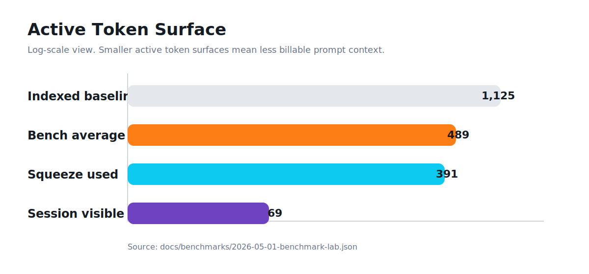
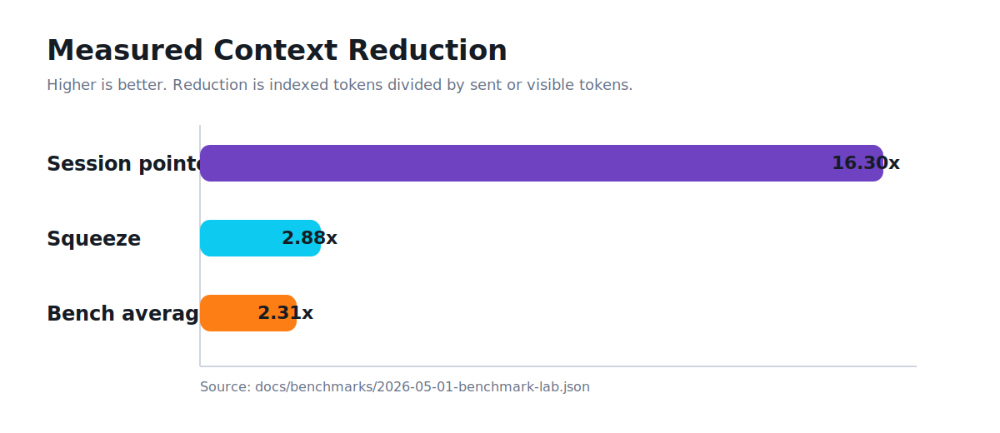

# Qorx Benchmarks

Qorx benchmark reports are reproducible local runs. They measure the Qorx
runtime on fixed inputs and publish the command outputs used for the claim.

Current reports:

- [2026-05-01 benchmark lab](2026-05-01-benchmark-lab.md)
- [2026-05-01 benchmark lab raw JSON](2026-05-01-benchmark-lab.json)
- [2026-05-02 Qorx repo self-benchmark](2026-05-02-qorx-self.md)
- [2026-05-02 Qorx repo self-benchmark raw JSON](2026-05-02-qorx-self.json)

## Charts





Run it again:

```powershell
python scripts/run-benchmark.py
```

## Boundary

These benchmarks use Qorx local token accounting. They do not prove provider
invoice savings, production latency under multi-user load, or downstream model
answer quality.
